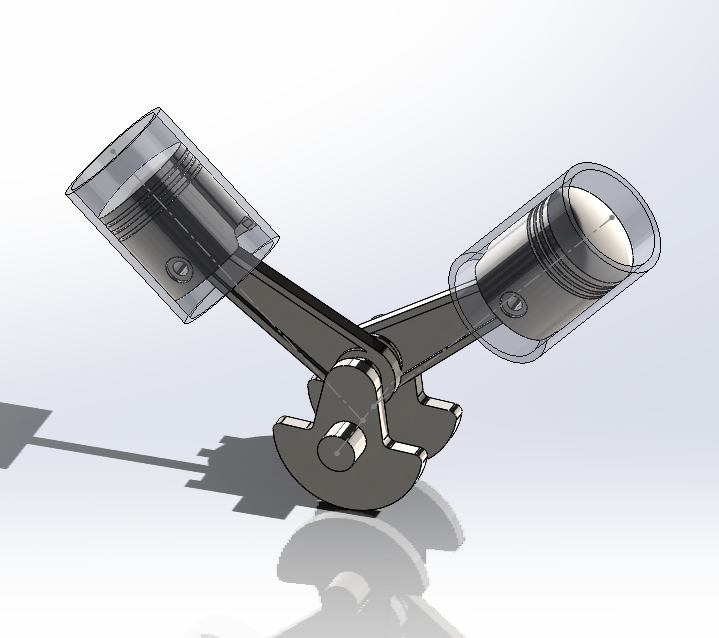
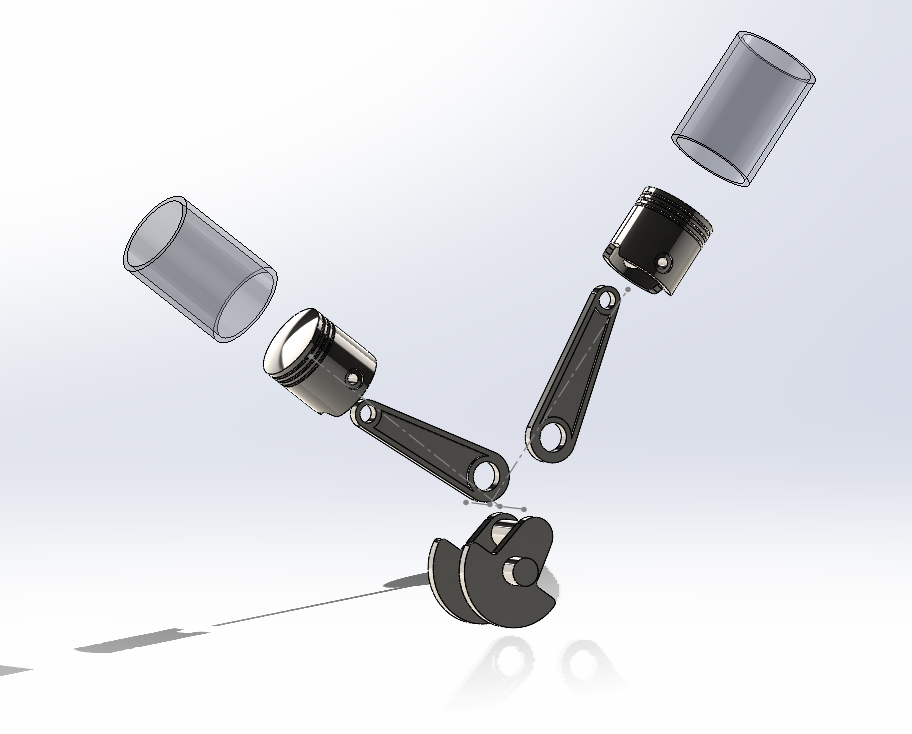
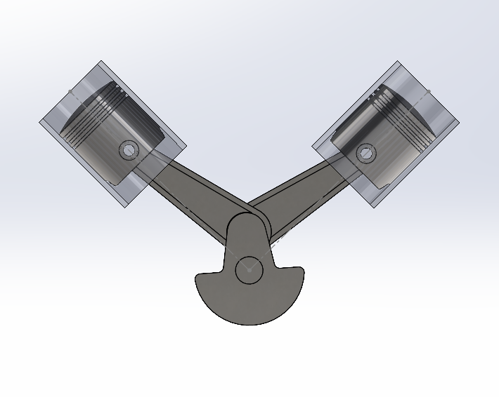

# 90-Degree-V-Twin-Engine
3D CAD modeling and assembly of a 90° V-twin engine developed using SolidWorks.
# 90° V-Twin Engine | SolidWorks

90° V-twin engine modeled and assembled in **SOLIDWORKS** as part of my mechanical CAD learning and design practice.

## Overview

This project is a 3D CAD model of a **90° V-twin engine** developed in **SOLIDWORKS**. The project involved modeling individual mechanical components and assembling them to create the complete engine assembly.

The project provided hands-on experience with **part modeling, assembly design, component relationships, and exploded-view creation**, while strengthening my understanding of mechanical CAD workflows.

---

## Project Preview

### Isometric View

### Exploded View

### Side View

---

## Main Components

* Piston
* Connecting Rod
* Crankshaft
* Cylinder Cover
* V-Twin Engine Assembly

---

## Skills Demonstrated

* Part Modeling
* Assembly Design
* Assembly Mates
* Exploded View Creation
* Mechanical CAD Workflow
* 3D Mechanical Design

---

## Software Used

* SOLIDWORKS

---

## Repository Contents

* `v engine assembly.SLDASM` – Main engine assembly
* `connecting rod.SLDPRT` – Connecting rod
* `cover.SLDPRT` – Cylinder cover
* `crankshaft.SLDPRT` – Crankshaft
* `piston.SLDPRT` – Piston
* Project preview images

---

## Author

**Barun Gautam**
Mechanical Engineering Student
